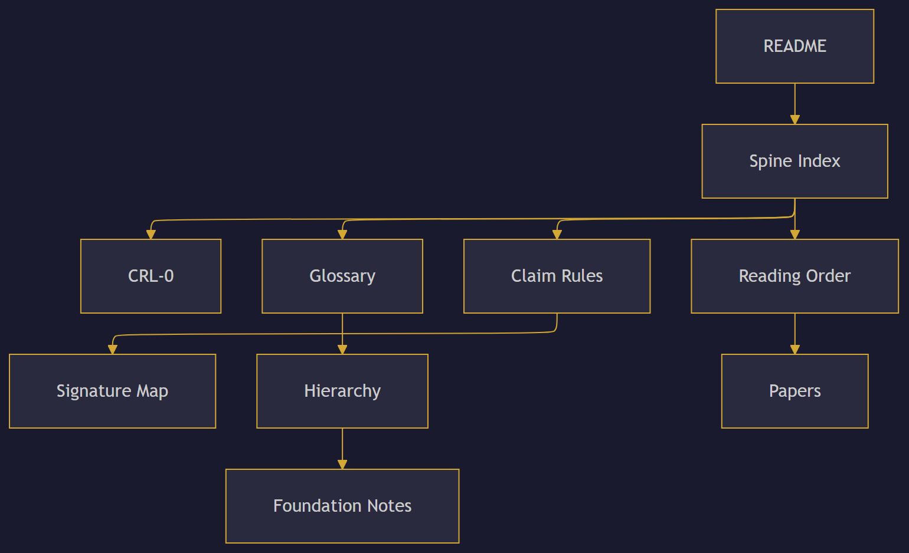

# Constraint Spine

**→ [spine.constraintphysics.org](https://spine.constraintphysics.org/)** — interactive site (papers, reading order, dependencies, stack, surfaces, notes, posture)

---

Constraint Physics canon / standards surface (CRL-0).

Versioned, auditable canon for a boundary-first program.

### Reader flow

This repository is the **public source of truth** for scope, exclusions,
reading order, controlled vocabulary, and governance decisions.

## Start here

1. [Spine Index](docs/index.md) — full document map
2. [Reading Order](docs/reading-order.md) — Paper VI first
3. [Glossary](docs/glossary.md) — 42 controlled terms
4. [Claim Rules](docs/CLAIM_RULES.md) — CRL-0 speech constraints
5. [Hierarchy](docs/HIERARCHY.md) — claim-discipline ordering (vocabulary, not derivation)
6. [Papers Index](docs/papers.md) — Zenodo records with DOIs
7. [License Posture: CRL-0](docs/licenses/CRL-0.md)
8. [FAQ](docs/faq.md) — boundary-first answers

## What this is not

- Not a methods repository
- Not an implementation guide
- Not an optimizer, controller, or predictor

## Change policy

Every edit to this repository is a governance event:
reviewed, diffable, and version-tagged.

See [CANON.md](CANON.md) for the full policy and [ADR-0008](registry/DECISIONS/ADR-0008.md) for the rationale.

## Field front door

The public website is **[constraintphysics.org](https://constraintphysics.org)**
(source repo: [constraintphysics-website](https://github.com/C-Zenno/constraintphysics-website)).

For docs orientation and navigation across repositories, see the
[constraint-physics](https://github.com/C-Zenno/constraint-physics) repository.

## License

Observer-only. Non-authoritative. No directives.
See license posture pages for details.
Text and documentation: [CC BY-ND 4.0](LICENSE) (verbatim share permitted, derivatives not; with methods/algorithms/thresholds/calibration/procedures/recipes non-grant).
