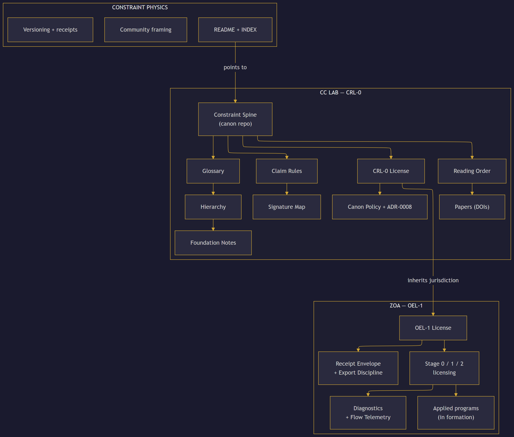

# Spine Map

Full reading-posture index of the Constraint Spine repository.

CRL-0 posture: this document is a **navigation aid**. It describes document
relationships and reading dependencies. It does not introduce new claims,
methods, or authority.

## Surface structure

## Surface legend

| Surface | Role | License | Holds |
|---------|------|---------|-------|
| Constraint Physics | Field front door | CRL-0 | Navigation pointers only — links to CC canon |
| CC Lab (Compressed Consciousness Laboratory) | Upstream doctrine | CRL-0 | Scope, exclusions, vocabulary, reading order, papers, foundation notes |
| ZOA (Zone of Avoidance) | Downstream application | OEL-1 | Use permissions, use-boundary posture, contracts, diagnostics |

## Governance principle

CC declares **scope + canon surfaces**. ZOA declares **use posture + licensing surfaces**.
Constraint Physics provides **field orientation** and points to CC as the
authoritative source.

Arrow directions indicate reading/inheritance dependencies, not authority flow.

## Classification rules

Artifact placement is described in
[CLASSIFICATION_RULES.md](CLASSIFICATION_RULES.md): public-facing placement
vocabulary for main-sequence and scoped-extension placement.
